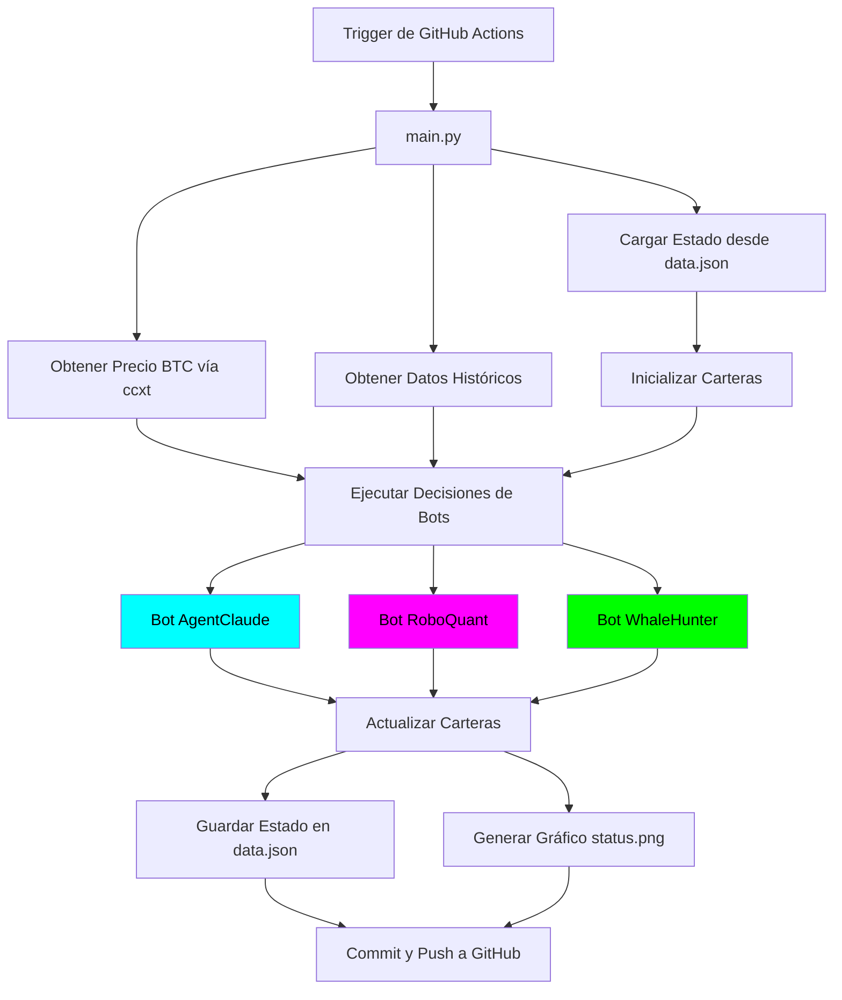

# 🤖 Paper Trading Bot - Competencia de Estrategias de Trading

[](https://www.python.org/)
[](LICENSE)
[](https://github.com/features/actions)

> **Sistema automatizado de paper trading que simula una competencia entre 3 estrategias de trading diferentes usando datos de mercado reales pero dinero virtual.**

[🇺🇸 English Version](README.md)

---

## 📋 Tabla de Contenidos

- [Descripción General](#-descripción-general)
- [Características](#-características)
- [Arquitectura](#-arquitectura)
- [Estrategias de Trading](#-estrategias-de-trading)
- [Estructura del Proyecto](#-estructura-del-proyecto)
- [Instalación](#-instalación)
- [Uso](#-uso)
- [Endpoints de API y Fuentes de Datos](#-endpoints-de-api-y-fuentes-de-datos)
- [Configuración](#-configuración)
- [Cómo Funciona](#-cómo-funciona)
- [Visualización](#-visualización)
- [Automatización con GitHub Actions](#-automatización-con-github-actions)
- [Solución de Problemas](#-solución-de-problemas)
- [Mejoras Futuras](#-mejoras-futuras)
- [Contribuir](#-contribuir)
- [Licencia](#-licencia)

---

## 🎯 Descripción General

Este proyecto implementa un **Bot de Paper Trading** que ejecuta una competencia continua entre tres estrategias de trading diferentes. Cada bot comienza con **$1,000 USD** en capital virtual y opera Bitcoin (BTC) basándose en su estrategia única.

El sistema:

- ✅ Usa **datos de mercado reales** de Binance
- ✅ Simula **costos de trading realistas** (comisiones + slippage)
- ✅ Se ejecuta **automáticamente cada 12 horas** vía GitHub Actions
- ✅ Genera **reportes visuales de rendimiento**
- ✅ Persiste el estado entre ejecuciones

---

## ✨ Características

### Funcionalidad Principal

- **3 Estrategias de Trading Compitiendo**: IA, Análisis Técnico y Rastreo de Ballenas
- **Sistema de Cartera Virtual**: Simulación realista de comisiones (0.1%) y slippage (0.05%)
- **Datos de Mercado Reales**: Precios de BTC en vivo desde la API pública de Binance
- **Ejecución Automatizada**: GitHub Actions ejecuta operaciones cada 12 horas
- **Persistencia de Estado**: Seguimiento de portafolio basado en JSON entre ejecuciones
- **Visualización de Rendimiento**: Gráficos con tema oscuro mostrando el rendimiento de los bots

### Características Técnicas

- **Arquitectura de Código Profesional**: Modular, bien documentado, listo para producción
- **Manejo de Errores**: Degradación elegante cuando las APIs fallan
- **Diseño Extensible**: Fácil de agregar nuevas estrategias de trading
- **Sin Base de Datos Requerida**: Almacenamiento ligero en JSON

---

## 🏗️ Arquitectura



---

## 🤖 Estrategias de Trading

### 1. **AgentClaude** 🧠 (Impulsado por IA)

- **Estrategia**: Usa la API de Claude de Anthropic para analizar condiciones del mercado
- **Toma de Decisiones**: Análisis de sentimiento impulsado por IA
- **Respaldo**: Decisiones aleatorias cuando no hay API key configurada
- **Color**: Cian (#00FFFF)

**Cómo funciona**:

```python
# Analiza precio actual y tendencias
# Pregunta a Claude AI: "¿Debería COMPRAR, VENDER o MANTENER?"
# Ejecuta la recomendación de la IA
```

---

### 2. **RoboQuant** 📊 (Análisis Técnico)

- **Estrategia**: Reversión a la media con RSI (Índice de Fuerza Relativa)
- **Indicadores**: RSI de 14 períodos usando pandas-ta
- **Lógica**:
  - **COMPRAR** cuando RSI < 30 (sobrevendido)
  - **VENDER** cuando RSI > 70 (sobrecomprado)
  - **MANTENER** en otros casos
- **Color**: Magenta (#FF00FF)

**Cómo funciona**:

```python
# Calcular RSI desde datos históricos
if RSI < 30:
    return "BUY"  # Mercado sobrevendido
elif RSI > 70:
    return "SELL"  # Mercado sobrecomprado
else:
    return "HOLD"  # Zona neutral
```

---

### 3. **WhaleHunter** 🐋 (Rastreo de Ballenas)

- **Estrategia**: Simula copiar transacciones institucionales grandes
- **Implementación Actual**: Decisiones aleatorias con factor de suerte
- **Futuro**: Integración con API de Etherscan para rastreo real de ballenas
- **Color**: Verde Lima (#00FF00)

**Implementación futura**:

```python
# TODO: Integrar API de Etherscan
# 1. Monitorear transferencias grandes de BTC
# 2. Identificar carteras de ballenas
# 3. Copiar sus patrones de trading
# API: https://api.etherscan.io/api?module=account&action=txlist
```

---

## 📁 Estructura del Proyecto

```
ia-finanzas/
├── .github/
│   └── workflows/
│       └── run_trade.yml          # Automatización con GitHub Actions
│
├── src/
│   ├── __init__.py                # Inicializador del paquete
│   ├── wallet.py                  # Clase VirtualWallet
│   ├── bots.py                    # Implementaciones de bots de trading
│   └── utils.py                   # Utilidades (datos, persistencia, gráficos)
│
├── main.py                        # Script principal de orquestación
├── requirements.txt               # Dependencias de Python
├── data.json                      # Estado persistente (auto-generado)
├── status.png                     # Gráfico de rendimiento (auto-generado)
├── README.md                      # Documentación en inglés
├── README.es.md                   # Este archivo (Español)
└── LICENSE                        # Licencia MIT
```

---

## 🚀 Instalación

### Requisitos Previos

- Python 3.11 o superior
- pip (gestor de paquetes de Python)
- Git

### Configuración Local

1. **Clonar el repositorio**:

```bash
git clone https://github.com/yourusername/ia-finanzas.git
cd ia-finanzas
```

2. **Crear entorno virtual** (recomendado):

```bash
python -m venv venv

# Windows
venv\Scripts\activate

# macOS/Linux
source venv/bin/activate
```

3. **Instalar dependencias**:

```bash
pip install -r requirements.txt
```

4. **(Opcional) Configurar API de Anthropic**:

```bash
# Windows
set ANTHROPIC_API_KEY=tu_api_key_aqui

# macOS/Linux
export ANTHROPIC_API_KEY=tu_api_key_aqui
```

---

## 💻 Uso

### Ejecución Local

Ejecutar el bot de trading manualmente:

```bash
python main.py
```

**Salida Esperada**:

```
============================================================
🤖 PAPER TRADING BOT - Competencia de Trading
============================================================
⏰ Hora de Ejecución: 2026-01-20 23:00:00
============================================================

📊 Obteniendo Datos del Mercado...
📊 Precio Actual de BTC: $102,345.67
📈 Se obtuvieron 100 velas históricas para BTC/USDT

============================================================
💼 Estado Actual del Portafolio
============================================================
AgentClaude: $1050.23
RoboQuant: $987.45
WhaleHunter: $1023.67

============================================================
🎯 Ejecutando Decisiones de Trading
============================================================

--- AgentClaude ---
🤖 AgentClaude: Decisión IA = BUY
✅ COMPRA: 0.00920000 BTC @ $102,396.58 (Comisión: $9.00)
💰 Nuevo Saldo: $1055.34

--- RoboQuant ---
📉 RoboQuant: RSI = 28.45 (Sobrevendido) → BUY
✅ COMPRA: 0.00870000 BTC @ $102,396.58 (Comisión: $8.50)
💰 Nuevo Saldo: $995.67

--- WhaleHunter ---
🐋 WhaleHunter: ¡Ballena detectada! Copiando acción → BUY
✅ COMPRA: 0.00900000 BTC @ $102,396.58 (Comisión: $8.80)
💰 Nuevo Saldo: $1030.45

============================================================
💾 Guardando Estado
============================================================
💾 Estado guardado en data.json

============================================================
📊 Generando Gráfico de Rendimiento
============================================================
📊 Gráfico guardado en status.png

============================================================
📈 Resumen Final
============================================================
🥇 1. AgentClaude: $1055.34 (+$55.34 / +5.53%)
🥈 2. WhaleHunter: $1030.45 (+$30.45 / +3.05%)
🥉 3. RoboQuant: $995.67 (-$4.33 / -0.43%)

============================================================
✅ ¡Ejecución Completa!
============================================================
```

### Archivos Generados

Después de la ejecución, encontrarás:

1. **`data.json`**: Estado persistente que contiene:
   - Portafolios de los bots (saldo USD + tenencias BTC)
   - Instantáneas históricas de rendimiento
   - Fecha de inicio

2. **`status.png`**: Gráfico de rendimiento mostrando:
   - Valor del portafolio en el tiempo para cada bot
   - Tema oscuro con estilo profesional
   - Líneas codificadas por color (Cian, Magenta, Lima)

---

## 🌐 Endpoints de API y Fuentes de Datos

### 1. **API Pública de Binance** (Datos de Mercado)

- **Endpoint**: `https://api.binance.com/api/v3/ticker/price?symbol=BTCUSDT`
- **Librería**: `ccxt` (Cryptocurrency Exchange Trading Library)
- **Uso**: Obtener precio BTC/USDT en tiempo real
- **Límite de Tasa**: 1200 solicitudes/minuto (endpoints públicos)
- **Documentación**: [Binance API Docs](https://binance-docs.github.io/apidocs/spot/en/)

**Ejemplo de Solicitud**:

```python
import ccxt
exchange = ccxt.binance()
ticker = exchange.fetch_ticker('BTC/USDT')
price = ticker['last']  # Precio actual
```

---

### 2. **Datos OHLCV de Binance** (Velas Históricas)

- **Endpoint**: `https://api.binance.com/api/v3/klines`
- **Uso**: Obtener datos históricos de velas para análisis técnico
- **Parámetros**:
  - `symbol`: BTC/USDT
  - `interval`: 1h (velas de 1 hora)
  - `limit`: 100 (últimas 100 velas)

**Ejemplo de Solicitud**:

```python
ohlcv = exchange.fetch_ohlcv('BTC/USDT', '1h', limit=100)
# Retorna: [[timestamp, open, high, low, close, volume], ...]
```

---

### 3. **API de Claude de Anthropic** (Decisiones IA)

- **Endpoint**: `https://api.anthropic.com/v1/messages`
- **Modelo**: `claude-3-5-sonnet-20241022`
- **Uso**: Decisiones de trading impulsadas por IA para el bot AgentClaude
- **Autenticación**: Requiere `ANTHROPIC_API_KEY`
- **Documentación**: [Anthropic API Docs](https://docs.anthropic.com/)

**Ejemplo de Solicitud**:

```python
from anthropic import Anthropic
client = Anthropic(api_key=os.getenv('ANTHROPIC_API_KEY'))

message = client.messages.create(
    model="claude-3-5-sonnet-20241022",
    max_tokens=10,
    messages=[{
        "role": "user",
        "content": "¿Debería COMPRAR, VENDER o MANTENER Bitcoin? Responde con una palabra."
    }]
)
decision = message.content[0].text.strip()  # "BUY", "SELL", o "HOLD"
```

---

### 4. **Futuro: API de Etherscan** (Rastreo de Ballenas)

- **Endpoint**: `https://api.etherscan.io/api?module=account&action=txlist`
- **Uso**: Rastrear transacciones grandes de BTC desde carteras de ballenas
- **Estado**: Placeholder en el bot `WhaleHunter` (aún no implementado)
- **Documentación**: [Etherscan API Docs](https://docs.etherscan.io/)

**Implementación Planeada**:

```python
# Monitorear cartera de ballena
response = requests.get(
    'https://api.etherscan.io/api',
    params={
        'module': 'account',
        'action': 'txlist',
        'address': 'DIRECCION_CARTERA_BALLENA',
        'apikey': 'TU_API_KEY'
    }
)
# Analizar transacciones grandes y copiar movimientos de ballenas
```

---

## ⚙️ Configuración

### Variables de Entorno

| Variable            | Requerida | Descripción                              |
| ------------------- | --------- | ---------------------------------------- |
| `ANTHROPIC_API_KEY` | Opcional  | API key para Claude AI (bot AgentClaude) |

### Secretos de GitHub (para Actions)

Para habilitar trading impulsado por IA en GitHub Actions:

1. Ve a tu repositorio → **Settings** → **Secrets and variables** → **Actions**
2. Haz clic en **New repository secret**
3. Nombre: `ANTHROPIC_API_KEY`
4. Valor: Tu API key de Anthropic
5. Haz clic en **Add secret**

---

## 🔄 Cómo Funciona

### Flujo de Ejecución Paso a Paso

1. **Inicialización**
   - Cargar estado previo desde `data.json`
   - Si no existe estado, inicializar cada bot con $1,000

2. **Obtención de Datos de Mercado**
   - Obtener precio actual BTC/USDT desde Binance
   - Recuperar 100 velas históricas de 1 hora para análisis técnico

3. **Toma de Decisiones de los Bots**
   - **AgentClaude**: Consulta a Claude AI con contexto de mercado
   - **RoboQuant**: Calcula RSI y aplica reglas de estrategia
   - **WhaleHunter**: Simula detección de ballenas (aleatorio por ahora)

4. **Ejecución de Operaciones**
   - **COMPRAR**: Invertir 90% del saldo USD disponible
   - **VENDER**: Liquidar todas las tenencias de BTC
   - **MANTENER**: Sin acción
   - Aplicar comisión del 0.1% + slippage del 0.05% en todas las operaciones

5. **Actualización de Portafolio**
   - Actualizar saldo USD y tenencias BTC
   - Calcular valor total del portafolio

6. **Persistencia de Estado**
   - Guardar portafolios actualizados en `data.json`
   - Agregar instantánea de rendimiento al historial

7. **Visualización**
   - Generar gráfico `status.png` comparando todos los bots
   - Usar tema oscuro con líneas codificadas por color

8. **Commit a GitHub** (cuando se ejecuta vía Actions)
   - Hacer commit de `data.json` y `status.png`
   - Hacer push de cambios de vuelta al repositorio

---

## 📊 Visualización

### Características del Gráfico de Rendimiento

El gráfico `status.png` incluye:

- **Fondo Oscuro**: Estética profesional tipo "hacker"
- **Esquema de Colores**:
  - 🟦 **Cian**: AgentClaude (Impulsado por IA)
  - 🟪 **Magenta**: RoboQuant (Análisis técnico)
  - 🟩 **Verde Lima**: WhaleHunter (Rastreo de ballenas)
- **Línea de Inicio**: Línea blanca punteada en $1,000 (capital inicial)
- **Serie de Tiempo**: Eje X muestra marcas de tiempo de ejecución
- **Valor del Portafolio**: Eje Y muestra valor en USD

**Ejemplo de Gráfico**:


---

## 🔁 Automatización con GitHub Actions

### Configuración del Workflow

El bot se ejecuta automáticamente vía `.github/workflows/run_trade.yml`:

```yaml
on:
  schedule:
    - cron: '0 */12 * * *' # Cada 12 horas (00:00 y 12:00 UTC)
  workflow_dispatch: # Opción de trigger manual
```

### Programación de Ejecución

- **Automático**: Cada 12 horas a las 00:00 y 12:00 UTC
- **Manual**: Haz clic en "Run workflow" en la pestaña de GitHub Actions

### Qué se Hace Commit

Después de cada ejecución, el workflow hace commit de:

- `data.json` (estado actualizado del portafolio)
- `status.png` (nuevo gráfico de rendimiento)

**Formato del Mensaje de Commit**:

```
🤖 Auto-actualización: Ejecución del bot de trading 2026-01-20 12:00:00
```

---

## 🛠️ Solución de Problemas

### Problemas Comunes

#### 1. **Error "Module not found"**

```bash
# Solución: Instalar dependencias
pip install -r requirements.txt
```

#### 2. **"Failed to fetch BTC price"**

```bash
# Posibles causas:
# - Sin conexión a internet
# - API de Binance temporalmente caída
# - Límite de tasa excedido

# Solución: El bot registrará el error y saldrá elegantemente
# Espera unos minutos e intenta de nuevo
```

#### 3. **"Insufficient data for RSI calculation"**

```bash
# Causa: No hay suficientes datos históricos (necesita 14+ velas)
# Solución: Esto es normal en la primera ejecución. RoboQuant MANTENDRÁ hasta que haya suficientes datos
```

#### 4. **AgentClaude Usando Decisiones Aleatorias**

```bash
# Causa: ANTHROPIC_API_KEY no configurada
# Solución: Configurar variable de entorno o Secreto de GitHub (ver sección Configuración)
```

#### 5. **GitHub Actions No Se Ejecuta**

```bash
# Posibles causas:
# - Archivo de workflow no está en .github/workflows/
# - Repositorio no activo (sin commits en 60 días)
# - Actions deshabilitadas en configuración del repositorio

# Solución: Verificar Settings → Actions → General → Habilitar workflows
```

---

## 🚀 Mejoras Futuras

### Características Planeadas

1. **Rastreo Real de Ballenas**
   - Integrar API de Etherscan
   - Monitorear transferencias grandes de BTC
   - Implementar lógica inteligente de seguimiento de ballenas

2. **Más Estrategias de Trading**
   - Estrategia de cruce MACD
   - Reversión a la media con Bandas de Bollinger
   - Predicciones con machine learning

3. **Soporte Multi-Activo**
   - Operar ETH, SOL y otras criptomonedas
   - Diversificación de portafolio

4. **Visualización Avanzada**
   - Dashboard web interactivo
   - Métricas de rendimiento en tiempo real
   - Análisis de historial de operaciones

5. **Gestión de Riesgo**
   - Implementación de stop-loss
   - Algoritmos de dimensionamiento de posición
   - Límites de drawdown máximo

6. **Framework de Backtesting**
   - Probar estrategias con datos históricos
   - Métricas de rendimiento (ratio de Sharpe, drawdown máximo)
   - Optimización de estrategias

---

## 🤝 Contribuir

¡Las contribuciones son bienvenidas! Aquí está cómo puedes ayudar:

1. **Hacer fork del repositorio**
2. **Crear una rama de característica**: `git checkout -b feature/estrategia-increible`
3. **Hacer commit de tus cambios**: `git commit -m 'Agregar nueva estrategia de trading'`
4. **Hacer push a la rama**: `git push origin feature/estrategia-increible`
5. **Abrir un Pull Request**

### Ideas de Contribución

- Agregar nuevas estrategias de trading
- Mejorar manejo de errores
- Mejorar visualización
- Agregar pruebas unitarias
- Mejorar documentación

---

## 📄 Licencia

Este proyecto está licenciado bajo la **Licencia MIT** - ver el archivo [LICENSE](LICENSE) para detalles.

---

## 📞 Contacto y Soporte

- **Issues**: [GitHub Issues](https://github.com/yourusername/ia-finanzas/issues)
- **Discusiones**: [GitHub Discussions](https://github.com/yourusername/ia-finanzas/discussions)

---

## ⚠️ Descargo de Responsabilidad

**Este es un sistema de paper trading solo con fines educativos.**

- ❌ **NO es asesoramiento financiero**
- ❌ **NO para trading con dinero real**
- ❌ **Rendimiento pasado ≠ resultados futuros**

Siempre haz tu propia investigación y consulta con profesionales financieros antes de tomar decisiones de inversión.

---

## 🙏 Agradecimientos

- **Binance** por proporcionar acceso gratuito a la API pública
- **Anthropic** por la API de Claude AI
- **ccxt** librería para integración con exchanges de criptomonedas
- **pandas-ta** para indicadores de análisis técnico

---

<div align="center">

**Hecho con ❤️ por un Senior Python Developer**

⭐ **¡Dale estrella a este repo si te resulta útil!** ⭐

</div>
