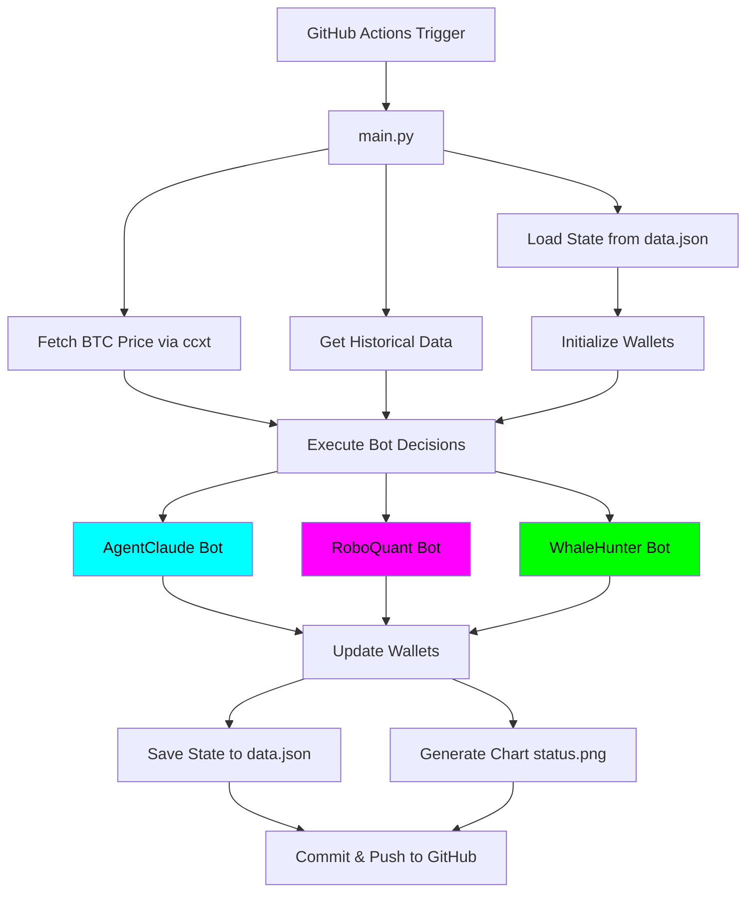

# 🤖 Paper Trading Bot - Trading Strategy Competition

[](https://www.python.org/)
[](LICENSE)
[](https://github.com/features/actions)

> **Automated paper trading system that simulates a competition between 3 different trading strategies using real market data but virtual money.**

[🇪🇸 Versión en Español](README.es.md)

---

## 📋 Table of Contents

- [Overview](#-overview)
- [Features](#-features)
- [Architecture](#-architecture)
- [Trading Strategies](#-trading-strategies)
- [Project Structure](#-project-structure)
- [Installation](#-installation)
- [Usage](#-usage)
- [API Endpoints & Data Sources](#-api-endpoints--data-sources)
- [Configuration](#-configuration)
- [How It Works](#-how-it-works)
- [Visualization](#-visualization)
- [GitHub Actions Automation](#-github-actions-automation)
- [Troubleshooting](#-troubleshooting)
- [Future Enhancements](#-future-enhancements)
- [Contributing](#-contributing)
- [License](#-license)

---

## 🎯 Overview

This project implements a **Paper Trading Bot** that runs a continuous competition between three different trading strategies. Each bot starts with **$1,000 USD** in virtual capital and trades Bitcoin (BTC) based on its unique strategy.

The system:

- ✅ Uses **real market data** from Binance
- ✅ Simulates **realistic trading costs** (fees + slippage)
- ✅ Runs **automatically every 12 hours** via GitHub Actions
- ✅ Generates **visual performance reports**
- ✅ Persists state between executions

---

## ✨ Features

### Core Functionality

- **3 Competing Trading Strategies**: AI-powered, Technical Analysis, and Whale Tracking
- **Virtual Wallet System**: Realistic fee (0.1%) and slippage (0.05%) simulation
- **Real Market Data**: Live BTC prices from Binance public API
- **Automated Execution**: GitHub Actions runs trades every 12 hours
- **State Persistence**: JSON-based portfolio tracking across runs
- **Performance Visualization**: Dark-themed charts showing bot performance

### Technical Features

- **Professional Code Architecture**: Modular, well-documented, production-ready
- **Error Handling**: Graceful degradation when APIs fail
- **Extensible Design**: Easy to add new trading strategies
- **No Database Required**: Lightweight JSON storage

---

## 🏗️ Architecture



---

## 🤖 Trading Strategies

### 1. **AgentClaude** 🧠 (AI-Powered)

- **Strategy**: Uses Anthropic's Claude API to analyze market conditions
- **Decision Making**: AI-driven sentiment analysis
- **Fallback**: Random decisions when API key not configured
- **Color**: Cyan (#00FFFF)

**How it works**:

```python
# Analyzes current price and trends
# Asks Claude AI: "Should I BUY, SELL, or HOLD?"
# Executes AI recommendation
```

---

### 2. **RoboQuant** 📊 (Technical Analysis)

- **Strategy**: RSI (Relative Strength Index) mean-reversion
- **Indicators**: 14-period RSI using pandas-ta
- **Logic**:
  - **BUY** when RSI < 30 (oversold)
  - **SELL** when RSI > 70 (overbought)
  - **HOLD** otherwise
- **Color**: Magenta (#FF00FF)

**How it works**:

```python
# Calculate RSI from historical data
if RSI < 30:
    return "BUY"  # Market oversold
elif RSI > 70:
    return "SELL"  # Market overbought
else:
    return "HOLD"  # Neutral zone
```

---

### 3. **WhaleHunter** 🐋 (Whale Tracking)

- **Strategy**: Simulates copying large institutional transactions
- **Current Implementation**: Random decisions with luck factor
- **Future**: Etherscan API integration for real whale tracking
- **Color**: Lime Green (#00FF00)

**Future implementation**:

```python
# TODO: Integrate Etherscan API
# 1. Monitor large BTC transfers
# 2. Identify whale wallets
# 3. Copy their trading patterns
# API: https://api.etherscan.io/api?module=account&action=txlist
```

---

## 📁 Project Structure

```
ia-finanzas/
├── .github/
│   └── workflows/
│       └── run_trade.yml          # GitHub Actions automation
│
├── src/
│   ├── __init__.py                # Package initializer
│   ├── wallet.py                  # VirtualWallet class
│   ├── bots.py                    # Trading bot implementations
│   └── utils.py                   # Utilities (data, persistence, charts)
│
├── main.py                        # Main orchestration script
├── requirements.txt               # Python dependencies
├── data.json                      # Persistent state (auto-generated)
├── status.png                     # Performance chart (auto-generated)
├── README.md                      # This file (English)
├── README.es.md                   # Spanish documentation
└── LICENSE                        # MIT License
```

---

## 🚀 Installation

### Prerequisites

- Python 3.11 or higher
- pip (Python package manager)
- Git

### Local Setup

1. **Clone the repository**:

```bash
git clone https://github.com/yourusername/ia-finanzas.git
cd ia-finanzas
```

2. **Create virtual environment** (recommended):

```bash
python -m venv venv

# Windows
venv\Scripts\activate

# macOS/Linux
source venv/bin/activate
```

3. **Install dependencies**:

```bash
pip install -r requirements.txt
```

4. **(Optional) Configure Anthropic API**:

```bash
# Windows
set ANTHROPIC_API_KEY=your_api_key_here

# macOS/Linux
export ANTHROPIC_API_KEY=your_api_key_here
```

---

## 💻 Usage

### Running Locally

Execute the trading bot manually:

```bash
python main.py
```

**Expected Output**:

```
============================================================
🤖 PAPER TRADING BOT - Trading Competition
============================================================
⏰ Execution Time: 2026-01-20 23:00:00
============================================================

📊 Fetching Market Data...
📊 Current BTC Price: $102,345.67
📈 Fetched 100 historical candles for BTC/USDT

============================================================
💼 Current Portfolio Status
============================================================
AgentClaude: $1050.23
RoboQuant: $987.45
WhaleHunter: $1023.67

============================================================
🎯 Executing Trading Decisions
============================================================

--- AgentClaude ---
🤖 AgentClaude: AI Decision = BUY
✅ BUY: 0.00920000 BTC @ $102,396.58 (Fee: $9.00)
💰 New Balance: $1055.34

--- RoboQuant ---
📉 RoboQuant: RSI = 28.45 (Oversold) → BUY
✅ BUY: 0.00870000 BTC @ $102,396.58 (Fee: $8.50)
💰 New Balance: $995.67

--- WhaleHunter ---
🐋 WhaleHunter: Whale detected! Copying action → BUY
✅ BUY: 0.00900000 BTC @ $102,396.58 (Fee: $8.80)
💰 New Balance: $1030.45

============================================================
💾 Saving State
============================================================
💾 State saved to data.json

============================================================
📊 Generating Performance Chart
============================================================
📊 Chart saved to status.png

============================================================
📈 Final Summary
============================================================
🥇 1. AgentClaude: $1055.34 (+$55.34 / +5.53%)
🥈 2. WhaleHunter: $1030.45 (+$30.45 / +3.05%)
🥉 3. RoboQuant: $995.67 (-$4.33 / -0.43%)

============================================================
✅ Execution Complete!
============================================================
```

### Files Generated

After execution, you'll find:

1. **`data.json`**: Persistent state containing:
   - Bot portfolios (USD balance + BTC holdings)
   - Historical performance snapshots
   - Start date

2. **`status.png`**: Performance chart showing:
   - Portfolio value over time for each bot
   - Dark theme with professional styling
   - Color-coded lines (Cyan, Magenta, Lime)

---

## 🌐 API Endpoints & Data Sources

### 1. **Binance Public API** (Market Data)

- **Endpoint**: `https://api.binance.com/api/v3/ticker/price?symbol=BTCUSDT`
- **Library**: `ccxt` (Cryptocurrency Exchange Trading Library)
- **Usage**: Fetch real-time BTC/USDT price
- **Rate Limit**: 1200 requests/minute (public endpoints)
- **Documentation**: [Binance API Docs](https://binance-docs.github.io/apidocs/spot/en/)

**Example Request**:

```python
import ccxt
exchange = ccxt.binance()
ticker = exchange.fetch_ticker('BTC/USDT')
price = ticker['last']  # Current price
```

---

### 2. **Binance OHLCV Data** (Historical Candles)

- **Endpoint**: `https://api.binance.com/api/v3/klines`
- **Usage**: Get historical candlestick data for technical analysis
- **Parameters**:
  - `symbol`: BTC/USDT
  - `interval`: 1h (1-hour candles)
  - `limit`: 100 (last 100 candles)

**Example Request**:

```python
ohlcv = exchange.fetch_ohlcv('BTC/USDT', '1h', limit=100)
# Returns: [[timestamp, open, high, low, close, volume], ...]
```

---

### 3. **Anthropic Claude API** (AI Decisions)

- **Endpoint**: `https://api.anthropic.com/v1/messages`
- **Model**: `claude-3-5-sonnet-20241022`
- **Usage**: AI-powered trading decisions for AgentClaude bot
- **Authentication**: Requires `ANTHROPIC_API_KEY`
- **Documentation**: [Anthropic API Docs](https://docs.anthropic.com/)

**Example Request**:

```python
from anthropic import Anthropic
client = Anthropic(api_key=os.getenv('ANTHROPIC_API_KEY'))

message = client.messages.create(
    model="claude-3-5-sonnet-20241022",
    max_tokens=10,
    messages=[{
        "role": "user",
        "content": "Should I BUY, SELL, or HOLD Bitcoin? Respond with one word."
    }]
)
decision = message.content[0].text.strip()  # "BUY", "SELL", or "HOLD"
```

---

### 4. **Future: Etherscan API** (Whale Tracking)

- **Endpoint**: `https://api.etherscan.io/api?module=account&action=txlist`
- **Usage**: Track large BTC transactions from whale wallets
- **Status**: Placeholder in `WhaleHunter` bot (not yet implemented)
- **Documentation**: [Etherscan API Docs](https://docs.etherscan.io/)

**Planned Implementation**:

```python
# Monitor whale wallet
response = requests.get(
    'https://api.etherscan.io/api',
    params={
        'module': 'account',
        'action': 'txlist',
        'address': 'WHALE_WALLET_ADDRESS',
        'apikey': 'YOUR_API_KEY'
    }
)
# Analyze large transactions and copy whale moves
```

---

## ⚙️ Configuration

### Environment Variables

| Variable            | Required | Description                             |
| ------------------- | -------- | --------------------------------------- |
| `ANTHROPIC_API_KEY` | Optional | API key for Claude AI (AgentClaude bot) |

### GitHub Secrets (for Actions)

To enable AI-powered trading in GitHub Actions:

1. Go to your repository → **Settings** → **Secrets and variables** → **Actions**
2. Click **New repository secret**
3. Name: `ANTHROPIC_API_KEY`
4. Value: Your Anthropic API key
5. Click **Add secret**

---

## 🔄 How It Works

### Step-by-Step Execution Flow

1. **Initialization**
   - Load previous state from `data.json`
   - If no state exists, initialize each bot with $1,000

2. **Market Data Fetching**
   - Fetch current BTC/USDT price from Binance
   - Retrieve 100 historical 1-hour candles for technical analysis

3. **Bot Decision Making**
   - **AgentClaude**: Queries Claude AI with market context
   - **RoboQuant**: Calculates RSI and applies strategy rules
   - **WhaleHunter**: Simulates whale detection (random for now)

4. **Trade Execution**
   - **BUY**: Invest 90% of available USD balance
   - **SELL**: Liquidate all BTC holdings
   - **HOLD**: No action
   - Apply 0.1% fee + 0.05% slippage on all trades

5. **Portfolio Update**
   - Update USD balance and BTC holdings
   - Calculate total portfolio value

6. **State Persistence**
   - Save updated portfolios to `data.json`
   - Append performance snapshot to history

7. **Visualization**
   - Generate `status.png` chart comparing all bots
   - Use dark theme with color-coded lines

8. **GitHub Commit** (when running via Actions)
   - Commit `data.json` and `status.png`
   - Push changes back to repository

---

## 📊 Visualization

### Performance Chart Features

The `status.png` chart includes:

- **Dark Background**: Professional "hacker" aesthetic
- **Color Scheme**:
  - 🟦 **Cyan**: AgentClaude (AI-powered)
  - 🟪 **Magenta**: RoboQuant (Technical analysis)
  - 🟩 **Lime Green**: WhaleHunter (Whale tracking)
- **Starting Line**: White dashed line at $1,000 (initial capital)
- **Time Series**: X-axis shows execution timestamps
- **Portfolio Value**: Y-axis shows USD value

**Example Chart**:


---

## 🔁 GitHub Actions Automation

### Workflow Configuration

The bot runs automatically via `.github/workflows/run_trade.yml`:

```yaml
on:
  schedule:
    - cron: '0 */12 * * *' # Every 12 hours (00:00 and 12:00 UTC)
  workflow_dispatch: # Manual trigger option
```

### Execution Schedule

- **Automatic**: Every 12 hours at 00:00 and 12:00 UTC
- **Manual**: Click "Run workflow" in GitHub Actions tab

### What Gets Committed

After each run, the workflow commits:

- `data.json` (updated portfolio state)
- `status.png` (new performance chart)

**Commit Message Format**:

```
🤖 Auto-update: Trading bot execution 2026-01-20 12:00:00
```

---

## 🛠️ Troubleshooting

### Common Issues

#### 1. **"Module not found" Error**

```bash
# Solution: Install dependencies
pip install -r requirements.txt
```

#### 2. **"Failed to fetch BTC price"**

```bash
# Possible causes:
# - No internet connection
# - Binance API temporarily down
# - Rate limit exceeded

# Solution: The bot will log the error and exit gracefully
# Wait a few minutes and try again
```

#### 3. **"Insufficient data for RSI calculation"**

```bash
# Cause: Not enough historical data (needs 14+ candles)
# Solution: This is normal on first run. RoboQuant will HOLD until enough data is available
```

#### 4. **AgentClaude Using Random Decisions**

```bash
# Cause: ANTHROPIC_API_KEY not set
# Solution: Set environment variable or GitHub Secret (see Configuration section)
```

#### 5. **GitHub Actions Not Running**

```bash
# Possible causes:
# - Workflow file not in .github/workflows/
# - Repository not active (no commits in 60 days)
# - Actions disabled in repository settings

# Solution: Check repository Settings → Actions → General → Enable workflows
```

---

## 🚀 Future Enhancements

### Planned Features

1. **Real Whale Tracking**
   - Integrate Etherscan API
   - Monitor large BTC transfers
   - Implement smart whale-following logic

2. **More Trading Strategies**
   - MACD crossover strategy
   - Bollinger Bands mean reversion
   - Machine learning predictions

3. **Multi-Asset Support**
   - Trade ETH, SOL, and other cryptocurrencies
   - Portfolio diversification

4. **Advanced Visualization**
   - Interactive web dashboard
   - Real-time performance metrics
   - Trade history analysis

5. **Risk Management**
   - Stop-loss implementation
   - Position sizing algorithms
   - Maximum drawdown limits

6. **Backtesting Framework**
   - Test strategies on historical data
   - Performance metrics (Sharpe ratio, max drawdown)
   - Strategy optimization

---

## 🤝 Contributing

Contributions are welcome! Here's how you can help:

1. **Fork the repository**
2. **Create a feature branch**: `git checkout -b feature/amazing-strategy`
3. **Commit your changes**: `git commit -m 'Add new trading strategy'`
4. **Push to the branch**: `git push origin feature/amazing-strategy`
5. **Open a Pull Request**

### Contribution Ideas

- Add new trading strategies
- Improve error handling
- Enhance visualization
- Add unit tests
- Improve documentation

---

## 📄 License

This project is licensed under the **MIT License** - see the [LICENSE](LICENSE) file for details.

---

## 📞 Contact & Support

- **Issues**: [GitHub Issues](https://github.com/yourusername/ia-finanzas/issues)
- **Discussions**: [GitHub Discussions](https://github.com/yourusername/ia-finanzas/discussions)

---

## ⚠️ Disclaimer

**This is a paper trading system for educational purposes only.**

- ❌ **NOT financial advice**
- ❌ **NOT for real money trading**
- ❌ **Past performance ≠ future results**

Always do your own research and consult with financial professionals before making investment decisions.

---

## 🙏 Acknowledgments

- **Binance** for providing free public API access
- **Anthropic** for Claude AI API
- **ccxt** library for cryptocurrency exchange integration
- **pandas-ta** for technical analysis indicators

---

<div align="center">

**Made with ❤️ by a Senior Python Developer**

⭐ **Star this repo if you find it useful!** ⭐

</div>
